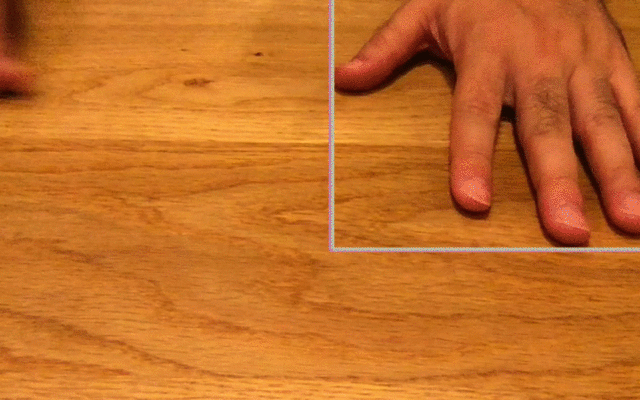

# ofxMobileNetSSD

## Description
ofxMobileNetSSD is a SSD(Single Shot Multibox Detection) with a voc mobilenet model addon for openframeworks.
Please refer Tensorflow Object Detection API for more details. https://github.com/tensorflow/models/tree/master/research/object_detection

OpenCV v.3.4.2 or upper includes object_detection dnn library ( https://github.com/opencv/opencv/tree/master/samples/dnn ) in
their own package. Therefore I designed ofxMobileNetSSD with OpenCV v.3.4.2 or upper version.

I created this addon for beginers or learner who are going to try object detection with SSD on OF.

## Usage
See Examples

### camera
Realtime Detection example for webcam video. It runs around 15-19 fps on my MacBook Pro ( 13-inch, 2016 )

## Install
### 1. Install OpenCV by brew.

    $ brew install opencv

### 2. Determin your opencv version
Based on OpenCV version, Please re-write ofxMobileNetSSD/addon_config.mk file. End of the file, there are some description about opencv path for your system. Please re-write the version according to your OpenCV version. Current (2018/7/28) is 3.4.2, If you find other version on your directory tree, /usr/local/Cellar/opencv , please do not forget fill in the correct version on the addon_config.mk file. You can get your current opencv version by typing below command.

    $ ls /usr/local/Cellar/opencv

### 3. Import and update camera example folder by projectgenerator. 
### 4. Run

## Compatibility
- only macOS ( tested on Hight Sierra and Sierra)
- of version: 0.9.8

## Licence
[MIT](https://opensource.org/licenses/MIT)

## Author
[TetsuakiBaba](https://github.com/TetsuakiBaba)

## Reference
1. OpenCV object_detection.cpp: https://qiita.com/buchayaty/items/4020100f531c07418f38
2. ofxYolov2: https://github.com/TetsuakiBaba/ofxYolov2
